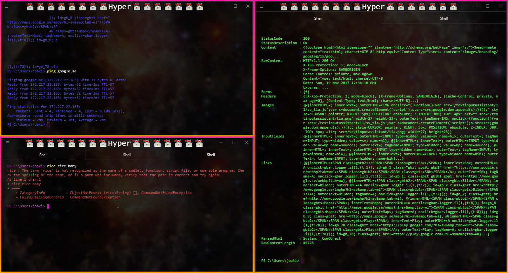

# hypernasa

> Nasa [Hyper](https://hyper.is) extension

A theme which replaces the terminal background with NASA's Picture of the Day. (https://apod.nasa.gov/apod/archivepix.html).




## Install

Add `hypernasa` to the plugins list in your `~/.hyper.js` config file.

## Options

*~/.hyper.js*
```javascript
module.exports = {
  config: {
    hypernasa: {
      overlayColor: #000,
      overlayOpacity: .25
    }
  }
}
```

## License

MIT © [Colm Seale]
